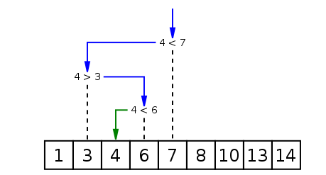

# Leçon 2 : Exemple d'un premier Algorithme

## Introduction

Dans cette leçon, nous allons voir un premier exemple d'algorithme en partant d'un problème simple.

---

## 🎯 Problème

L'objectif est de **deviner un nombre entre 1 et 100**.

🔹 À chaque tentative, nous savons si le nombre à deviner est **plus grand** ou **plus petit** que le nombre proposé.

Le problème consiste à **chercher efficacement un élément dans un tableau trié** :

```plaintext
[1, 2, 3, 4, ..., 100]
```

---

## 🔍 Recherche séquentielle (naïve)

L'approche **naïve** consiste à parcourir le tableau **élément par élément** :

```javascript
function linearSearch(tableauTrie, tentative) {
  for (let i = 0; i < tableauTrie.length; i++) {
    if (tableauTrie[i] === tentative) {
      return i;
    }
  }
  return -1;
}
```

### 👉 Explication
- 🔍 On **parcourt** tous les éléments un par un.
- ✅ **Si l’élément est trouvé**, on retourne **sa position**.
- ❌ **Sinon, on retourne `-1`**.

⚠️ **Inconvénient** : Cette méthode est **lente** pour des **grands tableaux** (`O(n)` en complexité).

---

## 🚀 Recherche dichotomique (Binary Search)

Pour un **tableau trié**, il existe un **algorithme optimal** : la **recherche dichotomique** (*binary search*).

### 🛠️ Principe
1. **Prendre l'élément du milieu** du tableau.
2. **Comparer avec la valeur recherchée** :
   - ✅ **Si égal**, c’est gagné !
   - 🔼 **Si supérieur**, on élimine la **moitié droite** du tableau.
   - 🔽 **Si inférieur**, on élimine la **moitié gauche** du tableau.
3. **Répéter jusqu'à trouver l’élément** (ou conclure qu'il n'existe pas).

---

## 🔎 Exemple : Chercher `4` dans un tableau trié

Prenons un **tableau trié de 9 éléments** :

```plaintext
[1, 3, 4, 7, 8, 10, 13, 14]
```

### 📈 Étapes
1. **Milieu** = `7` (position `5`).
   - ➡️ `7 > 4`, donc on **élimine la partie droite**.
2. **Nouveau milieu** = `3` (position `2`).
   - ➡️ `3 < 4`, donc on **élimine la partie gauche**.
3. **Nouveau milieu** = `4` (position `3`).
   - ✅ **Trouvé !**



---

## 📝 Implémentation en JavaScript

```javascript
function binarySearch(tableauTrie, valeurRecherchee) {
  let debut = 0;
  let fin = tableauTrie.length - 1;

  while (debut <= fin) {
    let milieu = Math.floor((debut + fin) / 2);

    if (tableauTrie[milieu] > valeurRecherchee) {
      fin = milieu - 1;
    } else if (tableauTrie[milieu] < valeurRecherchee) {
      debut = milieu + 1;
    } else {
      return milieu;
    }
  }
  return -1;
}
```

### 👉 Explication
- `debut` et `fin` permettent de garder en mémoire **la zone de recherche**.
- **Boucle while** : tant qu'il reste des éléments, on cherche au **milieu**.
- **Si la valeur recherchée est supérieure**, on ajuste `debut`.
- **Si inférieure**, on ajuste `fin`.
- **Si égale**, on retourne la position.

✅ **Complexité : `O(log n)`** (beaucoup plus rapide que la recherche séquentielle !)

---

## 🔧 Comparaison des algorithmes

| Algorithme              | Complexité | Avantage               | Inconvénient          |
|-------------------------|------------|------------------------|-----------------------|
| **Recherche séquentielle** | `O(n)`      | Simple à implémenter  | Lente sur grands tableaux |
| **Binary Search**       | `O(log n)`  | Très rapide sur tableaux triés | Nécessite un tri préalable |

---

## 💡 Conclusion

- La **recherche séquentielle** est simple mais inefficace pour de **grandes bases de données**.
- La **recherche dichotomique** est **bien plus rapide (`O(log n)`)** mais ne fonctionne que sur un **tableau trié**.
- **Toujours privilégier la recherche dichotomique** lorsque cela est possible pour des performances optimales.

---

## 💡 Ressources Complémentaires
- [Documentation MDN sur les algorithmes de recherche](https://developer.mozilla.org/fr/docs/Learn/JavaScript/First_steps/Algorithmes)
- [Explication en vidéo sur la recherche dichotomique](https://www.youtube.com/watch?v=D5SrAga1pno)
```

### ✅ Caractéristiques du format :
- **Compatible avec MkDocs** 📘
- **Code JavaScript bien formaté** 📜
- **Images et icônes pour une meilleure lisibilité** 🎨
- **Tableaux pour la comparaison des méthodes** 📊
- **Liens vers des ressources externes** 🌍

Vous pouvez utiliser ce fichier **tel quel** dans votre documentation **MkDocs** ! 🚀

