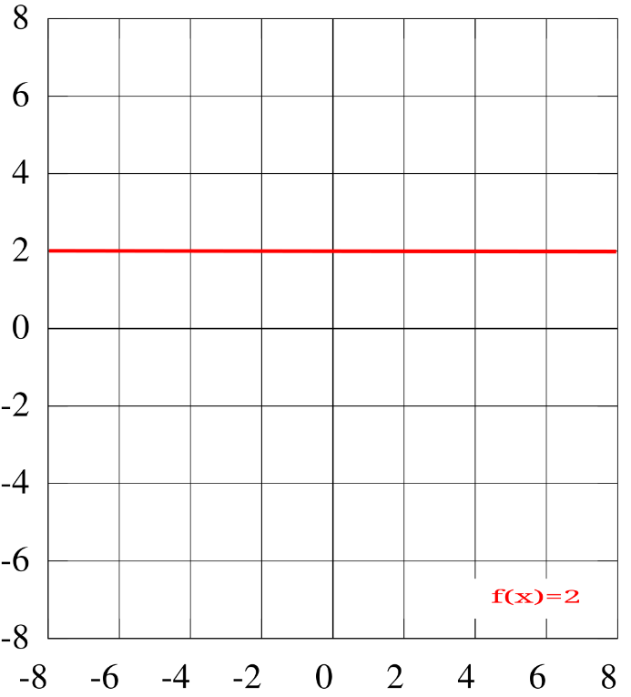
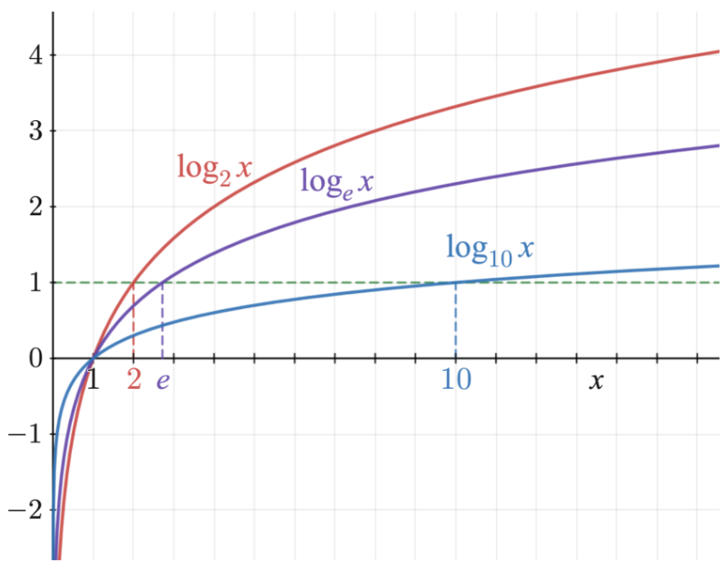
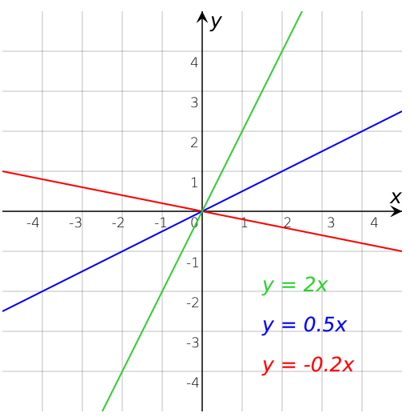
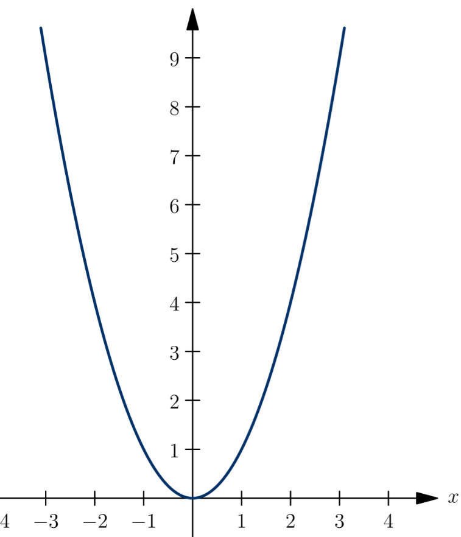
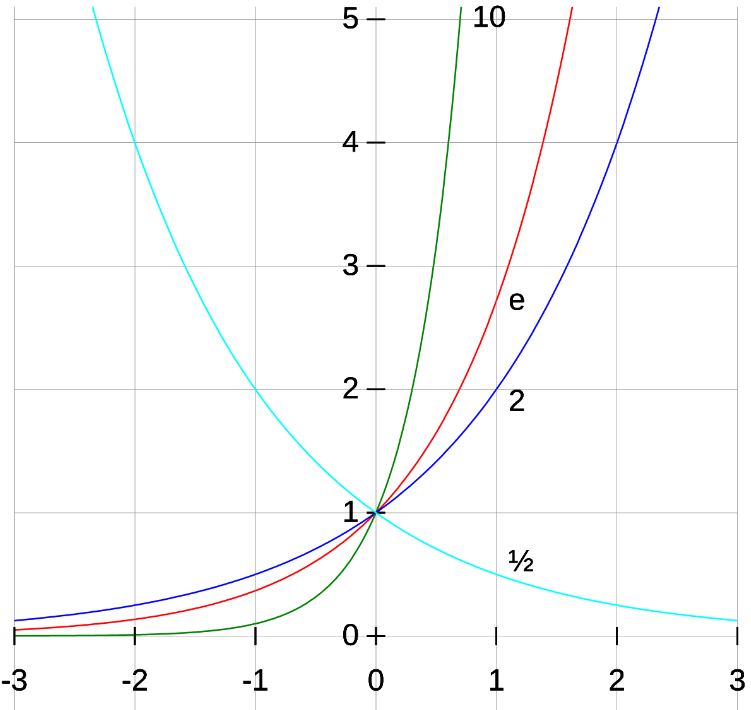
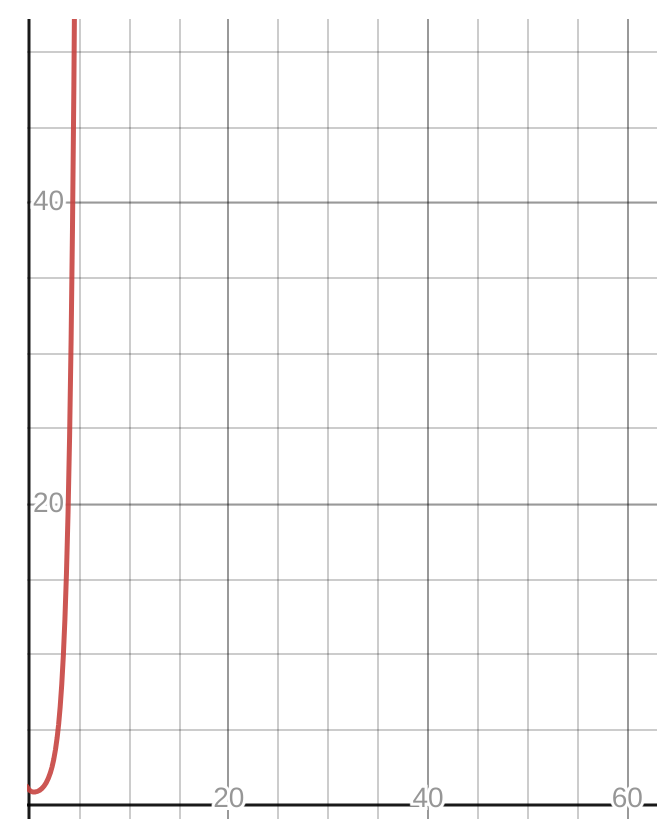

# ✨ Leçon 3 : Rappel sur les fonctions

## 📖 Rappel sur les fonctions

Avant d'aborder la complexité des algorithmes, nous devons effectuer quelques rappels simples sur les fonctions.

Nous avons besoin d'un certain nombre de fonctions pour évaluer rapidement le taux de croissance d'un algorithme.

A savoir : si j'augmente l'entrée de 1, est-ce que je dois faire 1 opération en plus, 10 opérations en plus, ou 10000 opérations en plus ? 🤯

Nous allons donc revoir rapidement les fonctions que nous utiliserons. 🚀

---

## 🌟 Rappels sur les fonctions

En mathématiques, une fonction permet de définir un résultat pour chaque valeur d’un ensemble.

La représentation graphique d'une fonction consiste à en dessiner l'ensemble des valeurs que peut prendre cette fonction.

La plupart des représentations graphiques de fonctions sont réalisées dans un repère cartésien orthonormé. Cela signifie que l'on utilise deux droites perpendiculaires, munies de la même unité de longueur.

---

### 🔄 Les fonctions constantes

Une fonction constante est une fonction qui retourne toujours la même valeur, quelle que soit sa variable.

---

### 🔢 Les fonctions logarithmiques

Le logarithme de base `b` d'un nombre réel strictement positif est la puissance à laquelle il faut élever la base `b` pour obtenir ce nombre.

Exemples :

- `log2(16) = 4` car il faut élever `2` à la puissance `4` pour obtenir `16`.
- `log3(27) = 3` car il faut élever `3` à la puissance `3` pour obtenir `27`.
- `log10(1000) = 3` car il faut élever `10` à la puissance `3` pour obtenir `1000`.

Dans la formation, nous aurons besoin du logarithme de base `2`, également appelé *logarithme binaire*. 🖥️

---

### 📏 Les fonctions linéaires

Une fonction linéaire est une fonction qui, à tout nombre `x`, associe le nombre `ax`, où `a` est un nombre donné : `f(x) = ax`.

Exemples de fonctions linéaires :

---

### 👩‍🎓 Les fonctions quadratiques

Une fonction quadratique ou *du second degré* est une fonction de la forme `f(x) = ax^2 + bx + c`.

Par exemple, la fonction carrée : `f(x) = x^2`.

---

### 🔄 Les fonctions exponentielles

Une fonction exponentielle de base `a` est une fonction de la forme `f(x) = a^x`.

Exemple :

Dans le cours, nous nous intéresserons à la fonction exponentielle de base `2`. 🔢

---

### ⚖️ La fonction factorielle

La factorielle d'un entier `n` est le produit des nombres entiers strictement positifs inférieurs ou égaux à `n`.

Par exemple : `3! = 3 × 2 × 1`.

