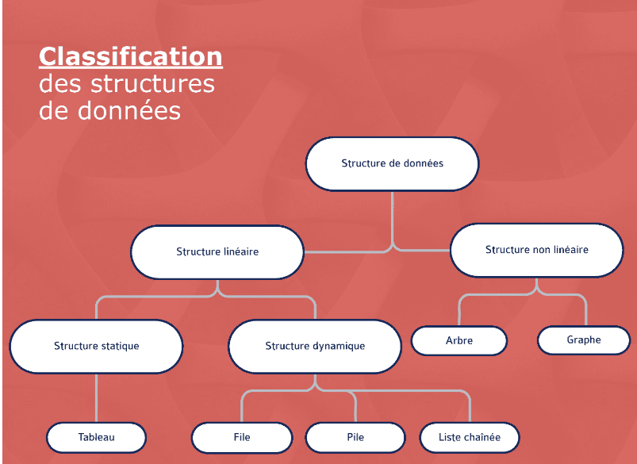

# 🏗️ Leçon 5 : Présentation des Structures de Données

## 🔍 Qu'est-ce qu'une structure de données ?

Une **structure de données** est une manière d'**organiser** et de **stocker** des données afin de les traiter plus efficacement. 💡

🔹 Chaque structure a des **avantages et des inconvénients** et est **adaptée** à une situation spécifique.  
🔹 Une structure de données comprend un ensemble réduit de **méthodes** permettant d'**accéder**, **modifier** ou **ajouter** un élément.

📌 L’ensemble de ces méthodes est appelé **l’interface** de la structure de données.  
📌 Pour une même interface, il peut exister **différentes implémentations**.

> L’utilisateur d’une structure de données **n’a besoin de connaître que son interface** et pas les détails de son implémentation. Mais dans cette formation, nous explorerons également leurs **implémentations** pour mieux les comprendre. 🚀

---

## 📊 Classification des structures de données

Voici une première classification des **structures de données principales** :

Les structures de données se divisent en **deux grandes catégories** :

### 1️⃣ **Les structures de données linéaires** 📏
➡️ Les éléments sont **arrangés de manière séquentielle**. Chaque élément est **connecté** au maximum à un **élément avant** et un **élément après**.

🔹 **Sous-catégories** :
- **Structures de données statiques** 🏗️
  - 📌 **Taille fixe en mémoire**.
  - ✅ Accès rapide aux éléments.
  - 🔹 **Exemple** : *Les tableaux*.

- **Structures de données dynamiques** 🔄
  - 📌 **Taille modifiable dynamiquement** pendant l'exécution.
  - ✅ Gestion plus flexible de la mémoire.
  - 🔹 **Exemples** : *Les piles, les files et les listes chaînées*.

### 2️⃣ **Les structures de données non linéaires** 🌳
➡️ Les éléments **ne sont pas arrangés de manière séquentielle**.  

🔹 **Caractéristiques** :
- Il est **impossible** de **parcourir** tous les éléments **en une seule passe**.
- Permet d’**optimiser** certains algorithmes de recherche et de manipulation des données.

📌 **Exemples** :  
✅ **Les arbres** 🌳  
✅ **Les graphes** 🔗  
✅ **Les tables de hachage** 🔢  

---

## 📌 Liste des structures de données couvertes dans cette formation 🎯

Il existe **plusieurs centaines** de structures de données utilisées en informatique. Voici celles que nous allons explorer en détail 🔥 :

| Catégorie | Structure de Données 📂 | Description |
|-----------|-------------------------|-------------|
| **Linéraire** | 📌 **Tableaux** | Stockage en mémoire contiguë avec accès rapide. |
| **Linéraire** | 🔗 **Listes chaînées** | Éléments reliés par des pointeurs pour plus de flexibilité. |
| **Linéraire** | 🏗️ **Piles (Stacks)** | LIFO (*Last In, First Out*), dernier entré, premier sorti. |
| **Linéraire** | ⏳ **Files (Queues)** | FIFO (*First In, First Out*), premier entré, premier sorti. |
| **Non Linéaire** | 🌳 **Arbres binaires** | Organisation hiérarchique pour la recherche rapide. |
| **Non Linéaire** | 🔍 **Arbres binaires de recherche** | Optimisation pour les recherches rapides. |
| **Non Linéaire** | 🏆 **Tas (Heaps)** | Priorisation des éléments pour les algorithmes d'optimisation. |
| **Non Linéaire** | 🔢 **Tables de hachage** | Association clé-valeur avec accès rapide. |
| **Non Linéaire** | 🔗 **Graphes** | Représentation de réseaux et de relations complexes. |
| **Non Linéaire** | 📐 **Matrice** | Représentation mathématique d’un ensemble de données structurées. |

---

## ✅ Conclusion

🚀 Les **structures de données** sont **essentielles** pour organiser et manipuler les informations efficacement.  
💡 **Comprendre leur fonctionnement** permet de choisir la meilleure structure selon le problème à résoudre.  
